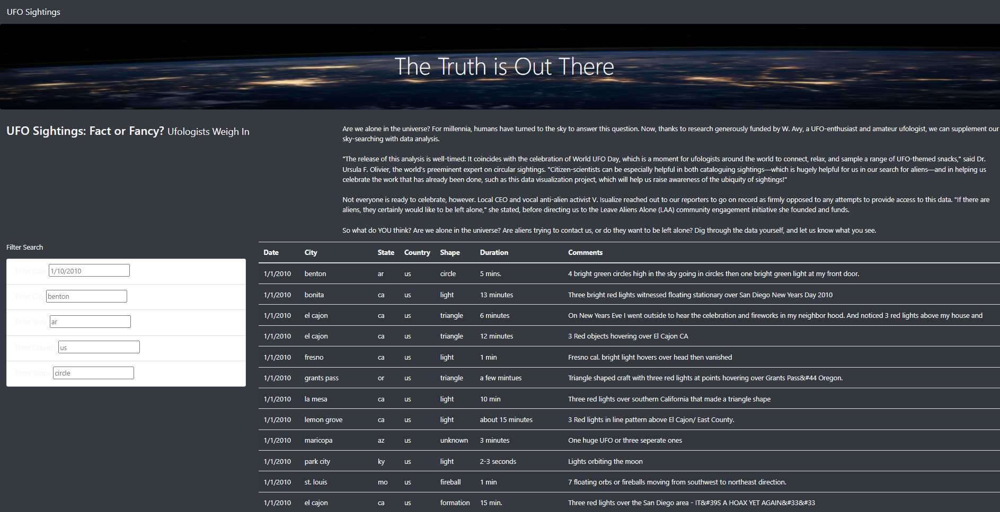
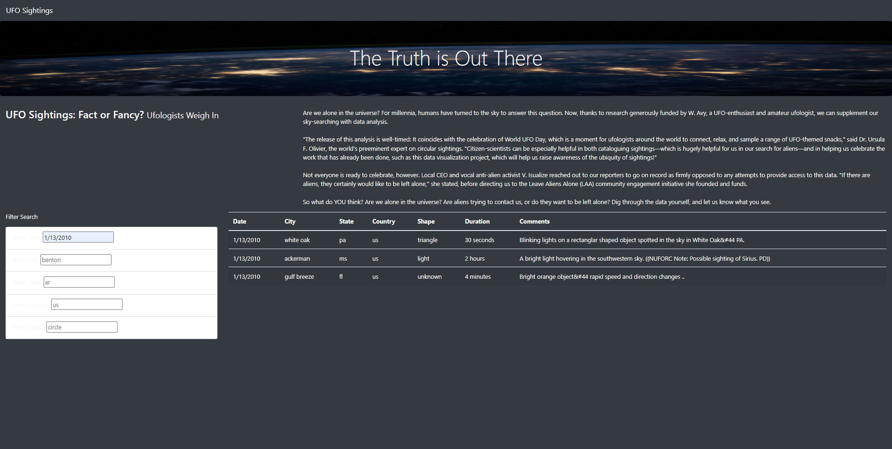
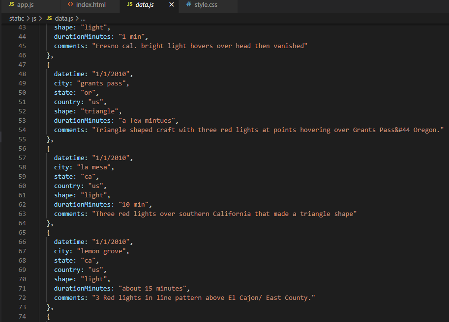

# UFOs

## Overview
The purpose of this project was to create a webpage with a dynamic table that shows information regarding UFOs based on multiple interactive filters that can be applied to narrow down the information search based on the user's desired input and criteria. The webpage was also lightly customized to make the page look more appealing and easy on the eyes. This was done using HTML, CSS, Bootstrap and Javascript.

## Results
In order to allow users to perform a search for the specific criteria, list elements were added into the index.html file for each filterable criteria (date, city, state, country, and shape). To keep track of all elements that change when a search is performed, a filters variable was created in the app.js file that stores the property "id" and the value entered from the user's input. For aesthetics, a placeholder was also included to give the user a sort of template value to enter. Before a search is done, the table to the right shows all existing data, as this table has not yet been filtered to any criteria yet. See below:

 

Once some criteria have been entered however, the table of data to the right changes accordingly to deliver the results that the user requested through the search. In the below image, a search criteria for the specific date of 1/13/2010 was entered:

 

## Summary
There are a few potential drawbacks of this webpage. Perhaps the most major drawback is that since the key and value pair data in the data.js file are all in lowercase, then the user would have to enter their criteria in only lowercase. Otherwise, the search will not work because this is case-sensitive. The city, the state, country, and shape all would have to be typed in lowercase.

There are also a few recommendations that can make this webpage better. One addition could be adding the ability to search for a date range. As it currently stands, a user can really only filter by one specific date. If the user wanted to search for multiple dates (for instance, the results of an entire month of a particular year), it would be tedious to filter through the results of each specific day of that month. This would be increasingly cumbersome the more dates the user wants to review.
Another recommendation is to add a filter for the duration of the UFO sighting. being that UFO sightings are very rare, perhaps the user wants to look at information on the shortest and longest sightings. The only drawback is that the user would need to enter in the information in the format exactly as it is written in the data.js code. Just like previously mentioned, this could be tricky because the data is not always uniform. Some data has the format with an integer and then the word "minutes" while some may abbreviate "minutes" to "min" and some may not specify an integer at all. Furthermore, some entries include an estimation word such as "around".

 
